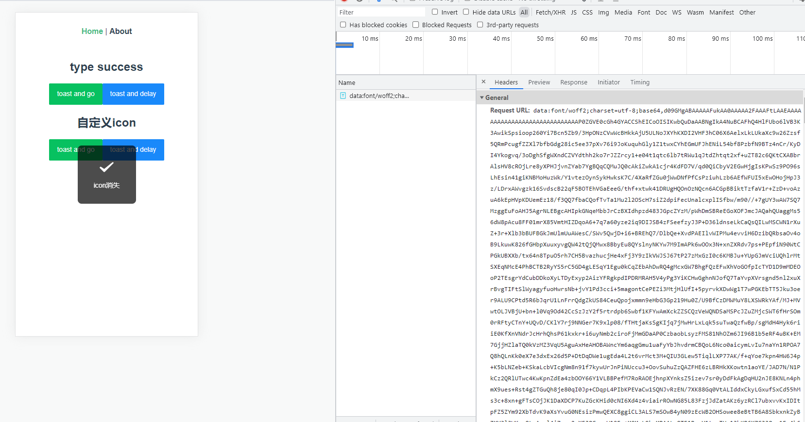
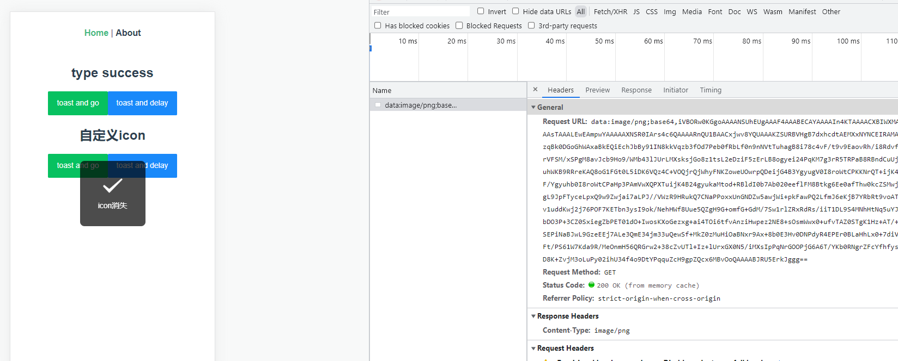

# 【vant】toast之后跳转页面时，iPhone上显示不出icon

## 问题代码

```vue
<van-button type="primary" @click="test1">toast and go</van-button>
```

```js
test1() {
  this.$toast({
    type: "success",
    message: "icon消失",
  });
  window.location.replace("https://www.baidu.com");
},
```

## 错误现象

在iPhone上访问页面，点击触发事件，toast可以看到message，但看不到icon。

在Android上正常（只验证了几个Android机型）。

## 原因分析





可以看到，触发toast的时候，无论是vant自带的icon还是自定义icon，都会发送请求获取data协议数据。在切换页面的时候，数据可能还没请求完成，表现出来就是icon不显示。

## 解决方案

加500ms延时再跳转。问题解决。

```vue
<van-button type="info" @click="test2">toast and delay</van-button>
```

```js
test2() {
  this.$toast({
    type: "success",
    message: "看得见icon",
  });
  setTimeout(() => {
    window.location.replace("https://www.baidu.com");
  }, 500);
},
```


## 存疑点

实验中用了以下一张772B的png图片作为icon（一个√，背景是透明的，图案是白色，可右键，新页签打开）


发现并未出现上述不显示的问题。而在另一个生产项目中用同一张图片确实复现了问题。怪哉！